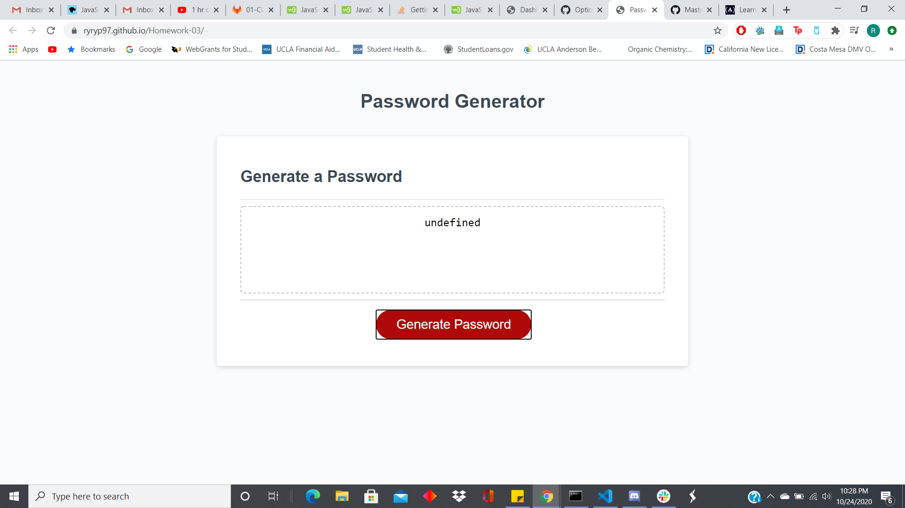

# Homework-03

This repository contains a program that runs on a webpage that can generate passwords.  The primary purpose for its creation was to practice working with JavaScript algorithms.

The site can be reached here: [Password Generator](https://ryryp97.github.io/Homework-03/)

What the site looks like: 

### Usage

The main usage for this site is to generate passwords.  Clicking on the "generate password" button will prompt the user to enter a number value for the desired length of their password.  Once a valid number is entered, the next 4 prompts that pop up let the user decide what kind of character they want in their password: lower case letters, upper case letters, numbers, and/or special characters.  Then, if at least one of those character types were selected, the password should be generated and will pop up in the form of an alert.

### Credits 

I'd like to thank [W3Schools](https://www.w3schools.com/) and their JavaScript guides, they were a great help.

### License

MIT License

Copyright (c) 2020 Ryan Petrecca

Permission is hereby granted, free of charge, to any person obtaining a copy of this software and associated documentation files (the "Software"), to deal in the Software without restriction, including without limitation the rights to use, copy, modify, merge, publish, distribute, sublicense, and/or sell copies of the Software, and to permit persons to whom the Software is furnished to do so, subject to the following conditions:

The above copyright notice and this permission notice shall be included in all copies or substantial portions of the Software.

THE SOFTWARE IS PROVIDED "AS IS", WITHOUT WARRANTY OF ANY KIND, EXPRESS OR IMPLIED, INCLUDING BUT NOT LIMITED TO THE WARRANTIES OF MERCHANTABILITY, FITNESS FOR A PARTICULAR PURPOSE AND NONINFRINGEMENT. IN NO EVENT SHALL THE AUTHORS OR COPYRIGHT HOLDERS BE LIABLE FOR ANY CLAIM, DAMAGES OR OTHER LIABILITY, WHETHER IN AN ACTION OF CONTRACT, TORT OR OTHERWISE, ARISING FROM, OUT OF OR IN CONNECTION WITH THE SOFTWARE OR THE USE OR OTHER DEALINGS IN THE SOFTWARE.
